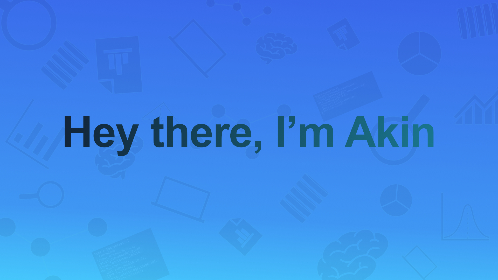

<!--
  Last Updated            Changes Made
  11-09-2022              Reduced header to 3
                          Change logo colors to 323330
                          Removed some icons from the headers
                          Added about heading, change position of how to reach me section
-->

<!--  -->

<!-- 

  

     </img>
  

 -->

<!-- Social Badges -->
### <b>How to reach me</b>

 

&nbsp;

### <b> About </b>
Wellcome to my page. I am a Database developer at Trane Technologies, with a degree in data analytics. Love everything tech, most especially artificial intelligence and graph networks.

&nbsp;

<!-- Skills -->
### <b>Tech Stack</b>

 

### <b>Credentials</b>
<a href='https://freecodecamp.org/certification/kunmi/javascript-algorithms-and-data-structures'>Javascripty Algorithms and Data Structures</a>
 
<a href='https://graphacademy.neo4j.com/u/a8e74ff6-2081-4095-a80e-69ed59a5220c/neo4j-fundamentals/#.YkGijfEuZUc.link'>Neo4j Fundamentals</a>
 
<a href='https://graphacademy.neo4j.com/u/a8e74ff6-2081-4095-a80e-69ed59a5220c/cypher-fundamentals/#.YkGiuaUSH8o.link'>Cypher Fundamentals</a>

&nbsp;
&nbsp;
&nbsp;
&nbsp;
&nbsp;

### <b>I’m currently working on</b>
- `Algorithmic Trading with Python`

### <b>I’m currently learning</b>
- `Project Management`
- `Software Development`
- `Data Analysis`

&nbsp;

### <b>⚡ Fun fact</b>
`I love to play the guitar🎸`

&nbsp;
&nbsp;
&nbsp;
&nbsp;
&nbsp;

### <b>Github Contributions</b>

<!--  -->

### <b>Language Usage</b>

</detail>

<!--
**OlamideMustapha/OlamideMustapha** is a ✨ _special_ ✨ repository because its `README.md` (this file) appears on your GitHub profile.

Here are some ideas to get you started:

- 🔭 I’m currently working on ...
- 🌱 I’m currently learning ...
- 👯 I’m looking to collaborate on ...
- 🤔 I’m looking for help with ...
- 💬 Ask me about ...
- 📫 How to reach me: ...
- 😄 Pronouns: ...
- ⚡ Fun fact: ...
-->
